# Renewal Radar — Technical Specification Document

| | |
|---|---|
| **Product** | Renewal Radar — SaaS Renewal Intelligence |
| **Document type** | Technical Specification + Dataflow Diagrams (DFD) |
| **Version** | 1.0 |
| **Status** | Living document — reflects `main` as of 2026-05-29 |
| **Audience** | Engineers, reviewers, security, ops |
| **Related docs** | `architecture/overview.md`, `architecture/layers.md`, `architecture/adr/*`, `runbooks/*` |

> **Diagram note.** All diagrams are [Mermaid](https://mermaid.js.org/) and render in GitHub, VS Code (with the Mermaid extension), and most Markdown viewers. Dataflow diagrams follow a simplified Gane–Sarson convention mapped onto Mermaid flowcharts:
>
> - **External entity** → plain rectangle `[Actor]`
> - **Process** → stadium `([Process])`
> - **Data store** → cylinder `[(Store)]`
> - **Data flow** → labelled arrow `-->|payload|`

---

## 1. Purpose & scope

### 1.1 What Renewal Radar is

Renewal Radar is a multi-tenant SaaS application that helps companies **track every SaaS subscription, hit every notice/cancellation deadline, and turn each renewal into a logged decision with savings attached.** It is positioned as **renewal intelligence**, competing with Vendr / Tropic / Sastrify / SpendHound — *not* as an enterprise CLM.

The defining product principle is **advisor, never agent**: Renewal Radar surfaces deadlines, drafts artifacts (cancellation letters, DPAs, prep packs), and records decisions, but it **never transacts or communicates with a customer's vendors on the customer's behalf**. Every outbound action is initiated by a human in the product.

### 1.2 In scope (this document)

The architecture, data model, dataflows, security model, and operational characteristics of the shipped system: tenancy & auth, the subscription/renewal engine, document ingestion + AI field extraction, the notification system, billing & tier enforcement, the public API, the vendor portal, procurement intake, and white-glove concierge.

### 1.3 Out of scope / non-goals

- **External integrations awaiting paid API keys**: bank/spend feeds (Plaid, Ramp/Brex/Mercury), accounting (QuickBooks/Xero/NetSuite), SSO discovery, HRIS/MDM/DNS provisioning, browser extension, mobile app, compliance platforms (Vanta/Drata), card issuing. These have interface seams but no live providers.
- Acting as a contract repository / redlining tool (CLM). Documents are stored to extract renewal-relevant fields, not to manage contract negotiation.

---

## 2. Technology stack

| Concern | Choice | Notes |
|---|---|---|
| Framework | **Next.js 14 (App Router)** | RSC + Server Actions; single deployable |
| Language | **TypeScript (strict)** | Path aliases `@app/* @server/* @ui/* @shared/*` |
| DB | **PostgreSQL** | via `postgres-js` driver |
| ORM / migrations | **Drizzle ORM + drizzle-kit** | SQL migrations in `drizzle/` |
| Customer auth | **Clerk** | Hosted auth; org = account |
| Staff auth | **Env allowlist** (`STAFF_EMAILS`) | Auto-provisions `staff_user` |
| Vendor auth | **Magic-link + DB session** | No Clerk; hashed tokens |
| Background jobs | **Inngest** | Cron + event functions |
| Email | **Resend** | No-ops to logs without key |
| Errors/telemetry | **Sentry** | via `instrumentation.ts` |
| Billing | **Stripe** | Checkout + Customer Portal + webhooks |
| Pluggable providers | Storage, OCR, AI extraction/insights, CRM, analytics, rate-limit, DNS | Interface + default (local/heuristic/console) impls |
| Tests | **Vitest** (DB-backed, single fork) | 708 tests / 69 files at time of writing |

---

## 3. Architecture overview

### 3.1 Layered monolith

The application is a single Next.js deployable, internally layered with **imports flowing inward toward the domain core** (full matrix in `architecture/layers.md`). ESLint boundary rules + structural tests enforce the matrix.

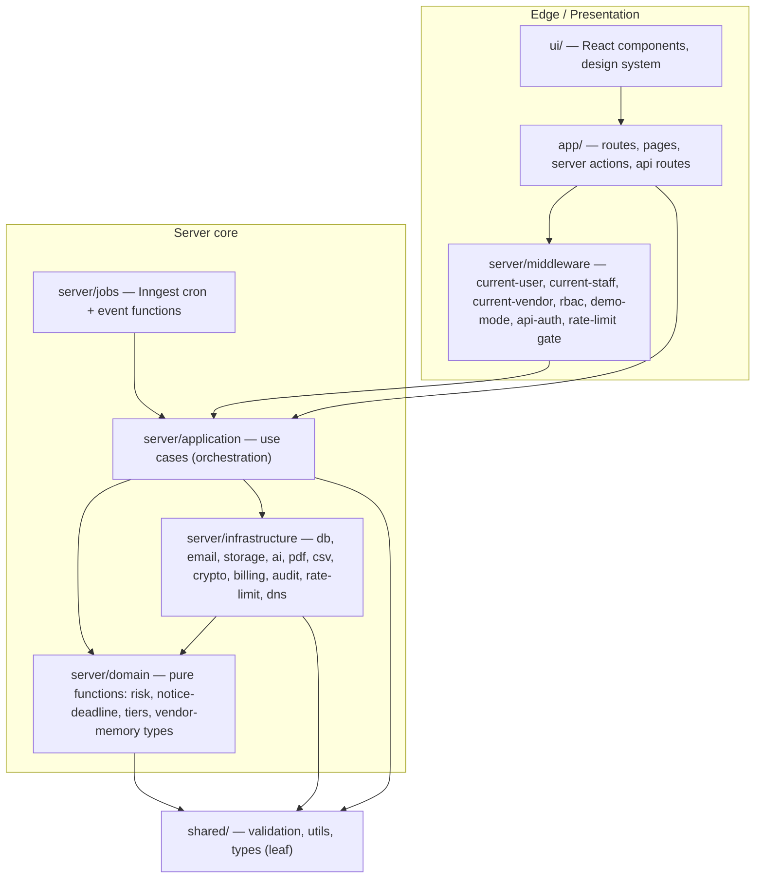

**Key rule:** `ui/` may not import runtime `@server/*` (only pure `@server/domain/*`, `import type` from schema, and `"use server"` actions). This keeps `postgres`, `node:crypto`, Stripe, and Resend out of the browser bundle. (ADR-0001.)

### 3.2 The three identity domains

Renewal Radar deliberately runs **three separate authentication models**, each with its own middleware resolver and its own audit log. They never mix.

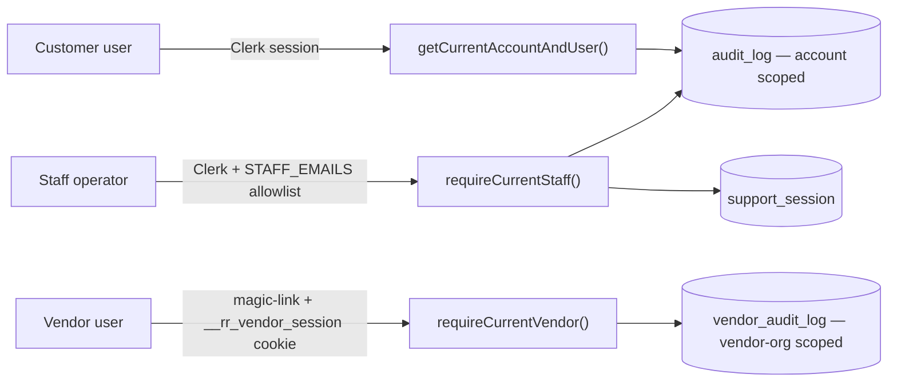

| Domain | Routes | Identity | Audit sink |
|---|---|---|---|
| **Customer** | `/(app)/*`, `/api/v1/*` | Clerk org → `account` + `user` | `audit_log` |
| **Staff** | `/staff/*` | Clerk email ∈ `STAFF_EMAILS` → `staff_user` | `audit_log` (via support session) + `vendor_audit_log` |
| **Vendor** | `/vendor/*` | magic-link → `vendor_user` + `vendor_session` | `vendor_audit_log` |

---

## 4. System context (DFD Level 0)

The context diagram shows Renewal Radar as a single process and every external entity it exchanges data with. Providers marked *(pluggable)* default to local/heuristic/console implementations until production keys are supplied.

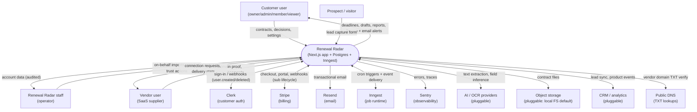

---

## 5. Major processes (DFD Level 1)

Level 1 decomposes the single process into the nine subsystems and the principal data stores they read/write. Arrows are data flows; cylinders are stores (Postgres tables grouped by domain).

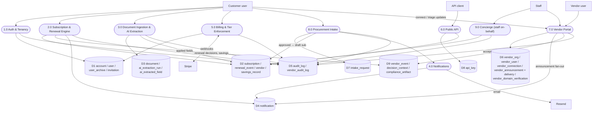

### 5.1 Process responsibilities

| # | Process | Core modules | Writes |
|---|---|---|---|
| 1.0 | Auth & Tenancy | `middleware/current-user`, `application/auth/provision`, Clerk webhook | D1, D5 |
| 2.0 | Subscription & Renewal Engine | `application/subscriptions`, `domain/notice-deadline`, `domain/risk`, `jobs/renewal-event-state` | D2, D9, D4, D5 |
| 3.0 | Document Ingestion & AI Extraction | `application/documents`, `infrastructure/{storage,ocr,ai}`, `jobs/extract-document` | D3, D2, D5 |
| 4.0 | Notifications | `application/notifications/dispatch`, `jobs/{notice-deadline-alerts,digests,slack-daily-summary}` | D4 |
| 5.0 | Billing & Tier Enforcement | `infrastructure/billing/*`, `middleware/tier-feature-response`, Stripe webhook | D1, D5 |
| 6.0 | Public API | `app/api/v1/*`, `application/api-keys`, `middleware/api-auth` | D8, reads D2 |
| 7.0 | Vendor Portal | `application/vendor-portal/*`, `middleware/current-vendor` | D6, D4, D9, D5(vendor) |
| 8.0 | Procurement Intake | `application/intake-requests`, `application/intake-requests/notifications` | D7, D2, D4, D5 |
| 9.0 | Concierge | `application/support-sessions`, `app/staff/*` | D2, D5 |

---

## 6. Data model

32 tables. Shown below in domain clusters (a single 32-entity diagram is unreadable). PKs are `uuid` defaulting to `gen_random_uuid()`; every tenant table carries `account_id` with a tenant-isolation test enforcing scope (ADR-0002).

### 6.1 Tenancy & access

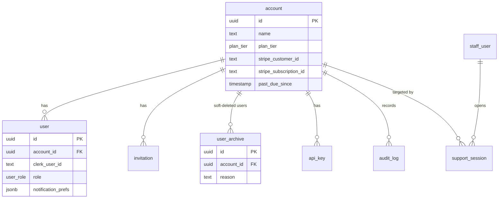

> **Never-delete rule (ADR + standing requirement):** users are never hard-deleted. Clerk `user.deleted` moves the row to `user_archive`; a lint rule + structural test ban `db.delete(usersTable)` in production code. Soft removals elsewhere (subscriptions → `cancelled`, vendor orgs → `archived`, API keys → `revokedAt`) preserve audit-log FKs.

### 6.2 Subscriptions, renewals & vendor memory

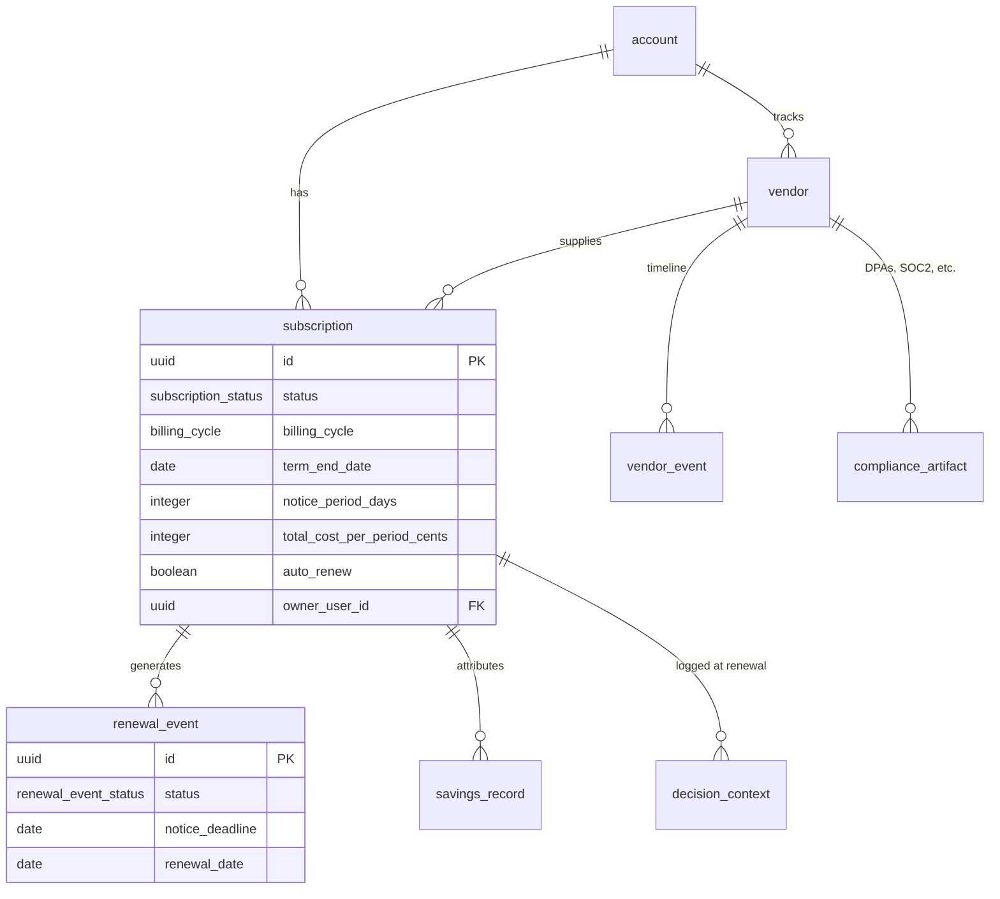

### 6.3 Document pipeline

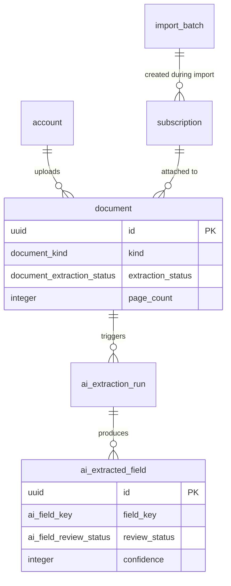

### 6.4 Vendor portal (T4.10)

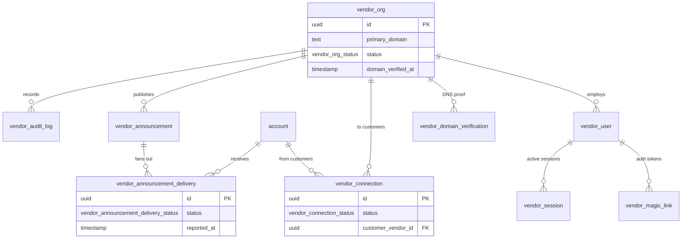

### 6.5 Cross-cutting stores

`notification` (email + in_app channels, deduped on `(user, trigger, entity, channel)`), `audit_log` (append-only, account-scoped), `vendor_audit_log` (append-only, vendor-org-scoped), `lead` (marketing capture), `integration` (encrypted config blobs — ADR-0005 envelope encryption).

---

## 7. Key dataflows (DFD Level 2) & sequences

### 7.1 Contract upload → AI extraction → review → apply

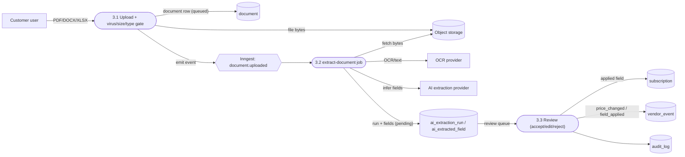

**Guards:** monthly AI-page cap enforced atomically before charging (ADR + revenue-leak fix); per-account storage cap; extraction failures surface explicit states (`failed`) rather than silent loss.

### 7.2 Renewal lifecycle & notice-deadline alerting

The renewal engine is a daily state machine plus a threshold-based alerter.

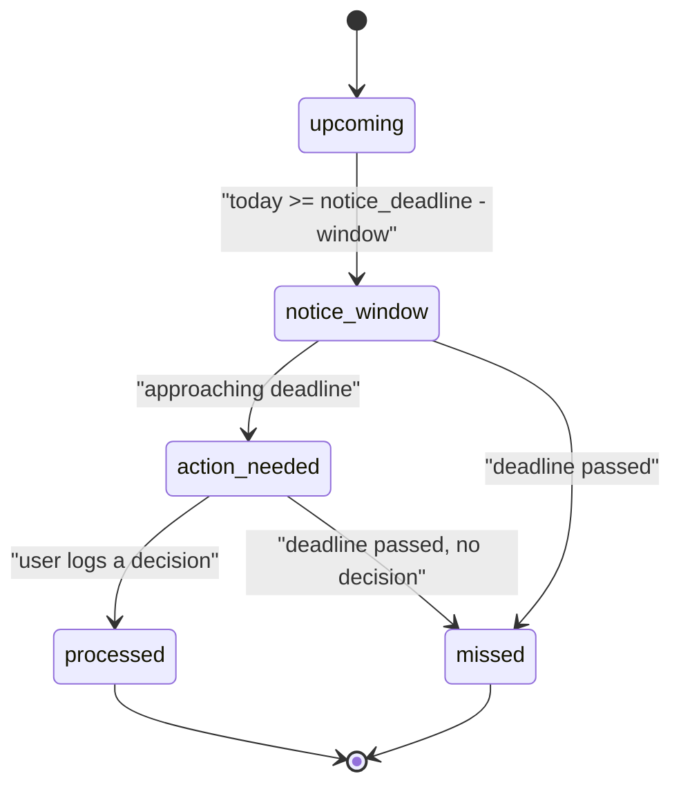

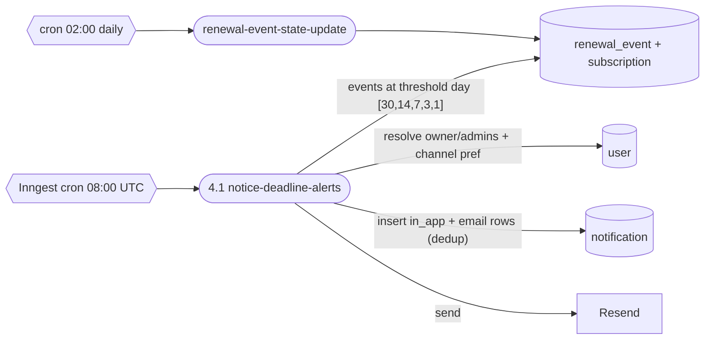

### 7.3 Notification fan-out (shared dispatch)

All request-path notifications route through one helper (`application/notifications/dispatch.ts`) so there is a single fan-out implementation honoring channel preferences + the dedupe constraint.

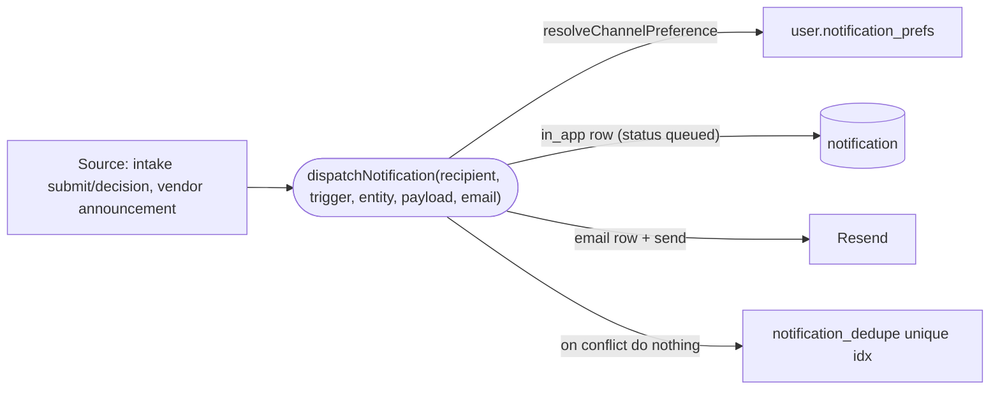

### 7.4 Vendor announcement: publish → deliver → triage

End-to-end vendor portal flow (Slices 3–6), demonstrating the advisor-not-agent boundary.

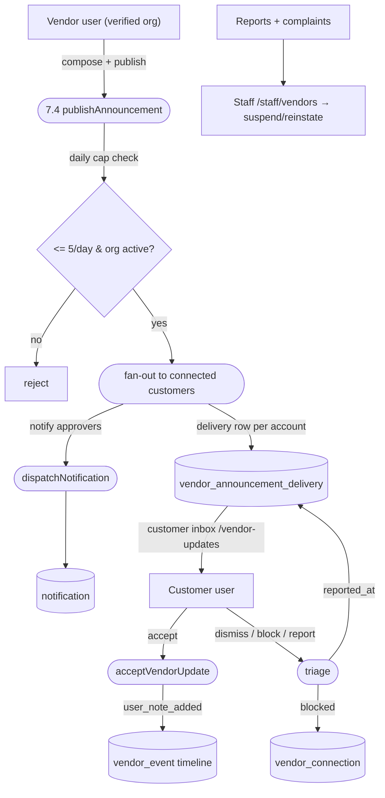

### 7.5 Vendor magic-link authentication (sequence)

```mermaid
sequenceDiagram
    participant V as Vendor user
    participant P as /vendor/sign-in
    participant A as vendor-portal app module
    participant DB as Postgres
    participant M as Resend

    V->>P: submit work email
    P->>A: requestMagicLink(email, ip)
    A->>A: reject personal-domain; rate-limit (IP + per-user 5/hr)
    A->>DB: upsert vendor_org/vendor_user; insert magic_link (SHA-256 hash, 15-min TTL)
    A->>M: email raw token link (token never stored)
    V->>P: click /vendor/auth/callback?token=...
    P->>A: redeemMagicLink(token)
    A->>DB: lookup by hash; timing-safe compare; mark consumed (single-use)
    A->>DB: create vendor_session (hashed); set HttpOnly cookie
    A-->>V: redirect /vendor/dashboard
```

### 7.6 Stripe billing webhook (sequence)

```mermaid
sequenceDiagram
    participant S as Stripe
    participant W as /api/webhooks/stripe
    participant DB as Postgres

    S->>W: event (signed)
    W->>W: verify signature; reject replay (event id seen)
    alt checkout.session.completed / subscription.updated
        W->>DB: set account.plan_tier + stripe_subscription_id
    else subscription past_due
        W->>DB: set past_due_since (grace window starts)
    else subscription deleted/canceled
        W->>DB: downgrade plan_tier (data-lockdown if over new cap)
    end
    W->>DB: audit_log entry
    W-->>S: 200
```

---

## 8. Security model

| Control | Mechanism | Enforcement |
|---|---|---|
| **Tenant isolation** | Every query filters `account_id` | ADR-0002 + tenant-isolation test suite |
| **RBAC** | `requireRole(user, "owner\|admin\|member\|viewer")` | Structural coverage test over all `app/**/actions.ts` (vendor/staff exempt by prefix with documented alternative auth) |
| **Audit trail** | `writeAuditLog` / `writeVendorAuditLog` in same tx as mutation | Coverage test: every mutating action + application module routes through the canonical writer |
| **Auth domains** | Clerk (customer), allowlist (staff), magic-link (vendor) | Separate middleware resolvers; `/vendor/*` excluded from Clerk middleware |
| **Token storage** | Magic-link, vendor session, API key, ICS feed = **SHA-256 hashed**; timing-safe compare | Raw secrets shown once, never persisted |
| **Secrets at rest** | `integration` config = envelope-encrypted | ADR-0005, `INTEGRATIONS_ENCRYPTION_KEY` |
| **Transport / headers** | HSTS, CSP, X-Frame-Options DENY, Referrer-Policy, Permissions-Policy | `src/middleware.ts` |
| **Rate limiting** | Pluggable limiter: lead capture, ICS feed, doc upload, API keys, vendor magic-link | `infrastructure/rate-limit` + per-feature policies |
| **Privacy** | Vendors see customer **account name only**, never user emails; cookie scoped to `/vendor` | Connection queries select account name only |
| **Legal disclaimers** | All AI-generated artifacts (DPA, cancellation letter) carry "not legal advice" | Product copy |

---

## 9. Cross-cutting concerns

- **Demo mode** (`DEMO_MODE`, ADR-0004): bypasses Clerk, seeds a fixed account/user/staff; local dev without standing up auth.
- **Structured logging**: `infrastructure/observability/logger` with component context; hot paths use it instead of `console.*` (enforced).
- **Migrations**: auto-applied at boot + boot-time schema sentinel check (fixes the class of "table missing in prod" crashes). drizzle-kit migrate against dev (`.env.local`) and test (`.env.test`).
- **Provider seams**: storage/OCR/AI/CRM/analytics/DNS/rate-limit all behind interfaces with a default impl, so the product runs end-to-end before paid keys exist and swaps implementations via env without code change.
- **Postgres-js transaction caveat** (documented pattern): the driver uses one connection per transaction context; nested `db.transaction(...)` deadlocks. Cross-module composition uses "prepare-then-commit" (see `approveIntakeRequest`).

---

## 10. Background jobs (Inngest)

| Function id | Trigger | Purpose |
|---|---|---|
| `renewal-event-state-update` | cron `0 2 * * *` | Advance renewal_event state machine |
| `notice-deadline-alerts` | cron `0 8 * * *` | Threshold alerts (30/14/7/3/1 days) |
| `weekly-digest` | cron `0 9 * * 1` | Weekly per-user digest |
| `monthly-summary` | cron `0 9 1 * *` | Monthly account summary |
| `slack-daily-summary` | cron `0 9 * * 1-5` | Slack webhook daily push (if configured) |
| `past-due-grace-enforcement` | cron `0 6 * * *` | Bound the past-due grace window → lockdown |
| `audit-retention-enforcement` | cron `0 7 * * *` | Purge audit rows past retention |
| `extract-document` | event `document.uploaded` | OCR + AI field extraction pipeline |

---

## 11. External dependencies & configuration

| Service | Env keys | Failure posture |
|---|---|---|
| Database | `DATABASE_URL` | Required; boot fails without it |
| Clerk | `CLERK_SECRET_KEY`, `CLERK_WEBHOOK_SECRET`, `NEXT_PUBLIC_CLERK_*` | Required in non-demo |
| Stripe | `STRIPE_SECRET_KEY`, `STRIPE_WEBHOOK_SECRET`, `STRIPE_*_PRICE_ID`, `NEXT_PUBLIC_STRIPE_PUBLISHABLE_KEY` | Billing disabled without keys |
| Resend | `RESEND_API_KEY`, `EMAIL_FROM` | Emails log instead of send |
| Inngest | `INNGEST_EVENT_KEY`, `INNGEST_SIGNING_KEY` | Jobs no-op locally |
| Sentry | `SENTRY_DSN`, `NEXT_PUBLIC_SENTRY_DSN`, `SENTRY_*` | Telemetry off without DSN |
| Pluggable | `STORAGE_PROVIDER`, `OCR_PROVIDER`, `AI_EXTRACTION_PROVIDER` | Default local/heuristic |
| Crypto | `INTEGRATIONS_ENCRYPTION_KEY` | Required to store integration secrets |
| App | `NEXT_PUBLIC_APP_URL`, `DEMO_MODE` | — |

---

## 12. API surface

**Customer/internal routes** (selected): `/api/documents/upload`, `/api/account/export` (GDPR), `/api/export/{exposure,savings,subscriptions}`, `/api/calendar/[token]` (ICS), `/api/prep-pack/[subscriptionId]` (PDF), `/api/subscriptions/sample-csv`.

**Public API v1** (bearer `rr_pk_*`, hashed, scoped, 60 req/min): `GET /api/v1/me`, `GET /api/v1/subscriptions`, `GET /api/v1/openapi.json`.

**Webhooks**: `/api/webhooks/clerk`, `/api/webhooks/stripe`, `/api/inngest`. **Ops**: `/api/health`.

---

## 13. Testing strategy & guardrails

- **DB-backed Vitest**, single fork; `seedTwoAccounts` / `truncateAll` harness; migrations applied once per process.
- **Structural / coverage tests** (the architectural "fuses"): tenant isolation, audit-log coverage, RBAC coverage, ban on `db.delete(usersTable)`, layer-boundary lint.
- **Contract tests** per application module (subscriptions, documents/AI, intake, vendor-portal slices, notifications).
- Current: **708 tests / 69 files**, typecheck clean, lint 0/0, production build green.

---

## 14. Deployment & operations

Single Next.js deployable (Vercel-style target). Postgres (Neon-compatible). Inngest hosts cron/event execution and calls back into `/api/inngest`. Health probe at `/api/health`. Migrations run at boot with a schema sentinel check. Runbooks under `docs/runbooks/`.

---

## 15. Open items & roadmap pointers

- **Webhooks (T4.6.x)**: outbound HMAC-signed webhooks with Inngest delivery — designed, not built.
- **External integrations**: all blocked on paid API procurement (see §1.3).
- **Cron unification**: `notice-deadline-alerts` still inlines the fan-out pattern that `dispatchNotification` now centralizes; a step-aware variant would let the cron adopt the shared helper.

---

## Appendix A — Table catalog (32)

`account`, `user`, `user_archive`, `invitation`, `vendor`, `subscription`, `renewal_event`, `savings_record`, `notification`, `audit_log`, `lead`, `integration`, `document`, `ai_extraction_run`, `ai_extracted_field`, `import_batch`, `vendor_event`, `decision_context`, `compliance_artifact`, `staff_user`, `support_session`, `api_key`, `intake_request`, `vendor_org`, `vendor_user`, `vendor_magic_link`, `vendor_session`, `vendor_audit_log`, `vendor_domain_verification`, `vendor_connection`, `vendor_announcement`, `vendor_announcement_delivery`.

## Appendix B — State machines

- **subscription**: `draft → active → {paused, pending_cancellation} → cancelled/expired`
- **renewal_event**: `upcoming → notice_window → action_needed → processed | missed`
- **intake_request**: `pending → approved | denied | duplicate | withdrawn`
- **vendor_org**: `pending → active → suspended ↔ active; → archived`
- **vendor_connection**: `pending → connected | declined; ↔ blocked`
- **vendor_announcement**: `draft → published`; **delivery**: `delivered → read → accepted | dismissed`

## Appendix C — Change log

| Version | Date | Notes |
|---|---|---|
| 1.0 | 2026-05-29 | Initial TSD covering the full shipped system through vendor portal (T4.10 Slices 1–6) and intake (T4.11). |
